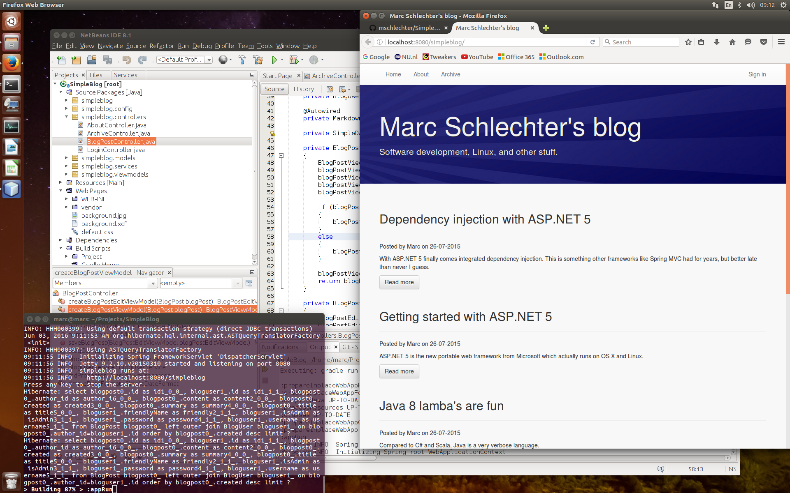

# SimpleBlog

SimpleBlog is a basic blog engine built with Java and Spring MVC. It
supports markdown syntax and pretty coloring of code blocks.

This project is still in an early stage of development and also a
reference project for me to learn about Java and Spring MVC development

I have a day job as a Microsoft .NET developer and it's fun to do something
different once in a while.

My development environment consists of:
- Ubuntu Linux LTS
- Java 8 JDK
- Gradle
- PostgreSQL
- NetBeans

## Status

Working:

1. It shows blog messages from the database (PostgreSQL).
2. A user can navigate between blog posts.
3. Syntax coloring of code blocks (prettify.js).
4. You can log in and post / edit new items.

Todo:

1. User registration.
2. Archive view with search functionality.
3. AngularJS integration.
4. Much more :-)

## Configuration / setup

Make sure you have a JDK installed, and Gradle. You will also need PostgreSQL
for the database. And of course git.

### 1. Clone the repository with git to a local folder.

    cd ~/Projects
    git clone https://github.com/mschlechter/SimpleBlog

### 2. Create the "simpleblog" database in PostgreSQL.

On a clean PostgreSQL installation first set the password:

    sudo -u postgres psql
    \password

You can choose to set "p0stgr3s" as the password, or you can choose something
yourself. But then you need to change the password in the simpleblog.properties
file of the project (located in src/main/resources).

You should also create the database:

    create database simpleblog;

And then you can quit:

    \q

### 3. Compile the project with Gradle and run it.

Do a clean build:

    gradle clean build

You can run this project using Gradle with the gretty plugin.

The command for this is:

    gradle appRun

By now you should be able to browse to <http://localhost:8080/SimpleBlog>
and see this project running.

